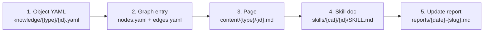

# Pathology-Wiki

> **An agent-extensible knowledge base for computational pathology.** Every paper, model, dataset, tool, and benchmark becomes a structured node, a paper-style page, and a Claude-readable skill — connected as a graph.

> 一个由 Claude 持续构造和维护的病理 AI 领域知识图谱网站。每个对象都同时是结构化数据、人类可读博文、和 agent 可调用 skill。

**Live site → [https://bokai-zhao.github.io/Pathology-Wiki/](https://bokai-zhao.github.io/Pathology-Wiki/)**

---

## What this is (and isn't)

Pathology-Wiki is **not a blog** and **not an awesome list**. It is a structured knowledge layer where:

- **Source of truth** is YAML under `knowledge/`
- **Human surface** is an MkDocs Material site rendered from Markdown under `content/`
- **Agent surface** is `SKILL.md` files under `skills/`
- **Topology** lives centrally in `knowledge/graph/{nodes,edges}.yaml`
- **Maintainer** is Claude Code, following the rules in [`CLAUDE.md`](./CLAUDE.md)

The original design rationale (Chinese, ~2500 lines) is in [`claude.md`](./claude.md).

---

## The Five-Artifact Rule

Every object added to the repo produces all five — never just one, never just a blog post.



Order matters; see [CLAUDE.md §2](./CLAUDE.md#2-the-five-artifact-rule-the-most-violated-rule).

---

## What's in the repo today

The bootstrap pass landed three sample objects and one anchor method:

| id | type | what it is | files |
|----|------|------------|-------|
| `uni-2024` | technical_article | UNI paper (Chen et al., *Nature Medicine* 2024) | [yaml](./knowledge/articles/technical/uni-2024.yaml) · [md](./content/articles/technical/uni-2024.md) · [skill](./skills/articles/uni-2024/SKILL.md) |
| `uni` | model | UNI ViT-L/16, DINOv2 SSL, Mass-100K | [yaml](./knowledge/models/uni.yaml) · [md](./content/models/uni.md) · [skill](./skills/models/uni/SKILL.md) |
| `openslide` | tool | The de-facto WSI I/O library | [yaml](./knowledge/tools/openslide.yaml) · [md](./content/tools/openslide.md) · [skill](./skills/tools/openslide/SKILL.md) |
| `panda` | dataset | PANDA prostate-grading challenge | [yaml](./knowledge/datasets/panda.yaml) · [md](./content/datasets/panda.md) · [skill](./skills/datasets/panda/SKILL.md) |
| `pathology-foundation-model` | method | Umbrella node for vision-only / VL / vision-omics PFMs | [yaml](./knowledge/methods/pathology-foundation-model.yaml) · [md](./content/methods/pathology-foundation-model.md) · [skill](./skills/methods/pathology-foundation-model/SKILL.md) |

**Graph state**: 5 nodes, 4 edges, 0 orphans, 0 dangling.

---

## Method taxonomy

The canonical 8-branch map. Every `method` node positions itself here.

```text
A. Traditional Computational Pathology
B. Deep Learning for WSI
C. Pathology Foundation Models           ← uni
D. Pathology Vision-Language Models
E. Multimodal Pathology AI
F. Benchmark and Evaluation
G. Clinical Translation
H. Agentic Pathology AI
```

Full sub-branch list under [`knowledge/taxonomies/method_map.yaml`](./knowledge/taxonomies/method_map.yaml).

---

## Adding new objects

In a Claude Code session, the five ingestion pipelines are registered as slash skills under `.claude/skills/`:

```
/add-article   {url | doi | pdf | abstract}
/add-tool      {github_url}
/add-dataset   {url}
/add-method    {name}
/add-benchmark {name | url}
```

Each pipeline classifies, extracts, links, validates, and writes all five artifacts. When an object cites another that doesn't have a node yet, Claude **stops and asks** rather than auto-stubbing. Full step lists in [CLAUDE.md §11](./CLAUDE.md#11-ingestion-pipelines-and-slash-commands).

For non-Claude contributors, [docs/CONTRIBUTING.md](./docs/CONTRIBUTING.md) describes the manual flow.

---

## Quick start

```bash
# Install Python tooling (data layer + site)
pip install -e .[site]

# Or install deps directly:
# pip install pyyaml jsonschema networkx click mkdocs mkdocs-material mkdocs-macros-plugin pymdown-extensions

# Validate, build graph, serve site
python scripts/python/validate_schema.py
python scripts/python/build_graph.py
mkdocs serve         # http://127.0.0.1:8000 — hot reload

# Production build
mkdocs build         # → site/
```

CI runs the same flow on every push (under 60 s) and pushes the built site to the `gh-pages` branch via `mkdocs gh-deploy`.

---

## Repo map

```text
Pathology-Wiki/
├── CLAUDE.md              ← operational rules for Claude (English + 中文注解)
├── claude.md              ← original design spec (Chinese, ~2500 lines)
├── README.md              ← you are here
├── mkdocs.yml             ← site config (theme, nav, plugins)
├── macros.py              ← Jinja macros that render YAML data into pages
├── knowledge/             ← source of truth: YAML
│   ├── articles/{clinical,technical,...}/
│   ├── methods/  models/  datasets/  tools/  benchmarks/
│   ├── taxonomies/        ← method, task, modality, clinical, multimodal_fusion
│   └── graph/             ← nodes.yaml + edges.yaml + graph.json (generated)
├── content/               ← human view: Markdown (one page per object)
├── skills/                ← agent view: SKILL.md docs
├── schemas/               ← YAML schemas (validated by validate_schema.py)
├── scripts/python/        ← validate_schema, build_graph, check_orphans, export_claude_context
├── reports/               ← per-ingestion update logs
├── docs/CONTRIBUTING.md   ← manual workflow for human contributors
└── .github/workflows/     ← deploy.yml (single-job MkDocs deploy)
```

---

## Roadmap

- **Triage 12 pending references** flagged in [`reports/2026-05-19-bootstrap-skeleton.md`](./reports/2026-05-19-bootstrap-skeleton.md) (e.g. `clam`, `abmil`, `weakly-supervised-mil`, `uni2`, `gigapath`, `wsi-pfm-benchmark`).
- **Real graph viz** — replace the text-form local graph with cytoscape / vis.js loaded via CDN.
- **Promote high-frequency skills** (`graph_builder`, `article_ingestion`) from documentation form to registered Claude Code skills under `.claude/skills/`.
- **More benchmarks** — fully model SpaPath-Bench and WSI-PFM Benchmark with executable workflows.
- **Verify metadata** marked `to_verify` on UNI / PANDA against primary sources.

---

## Stack

- [MkDocs Material](https://squidfunk.github.io/mkdocs-material/) for the static site
- [DINOv2](https://github.com/facebookresearch/dinov2) recipe behind UNI / many PFMs
- [OpenSlide](https://openslide.org/) for WSI I/O
- [Claude Code](https://claude.com/claude-code) (Opus 4.7) as the maintainer agent

---

> **简**：这是一个由 Claude Code 维护的病理 AI 知识库 + GitHub Pages 站点。点上面的 Live site 就能浏览；想让 Claude 加新对象就在会话里说 `/add-article {url}`。运维规则全在 `CLAUDE.md`，设计原文在 `claude.md`。
